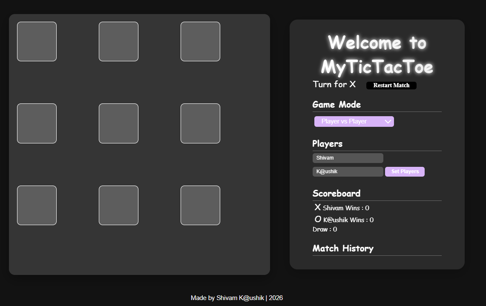
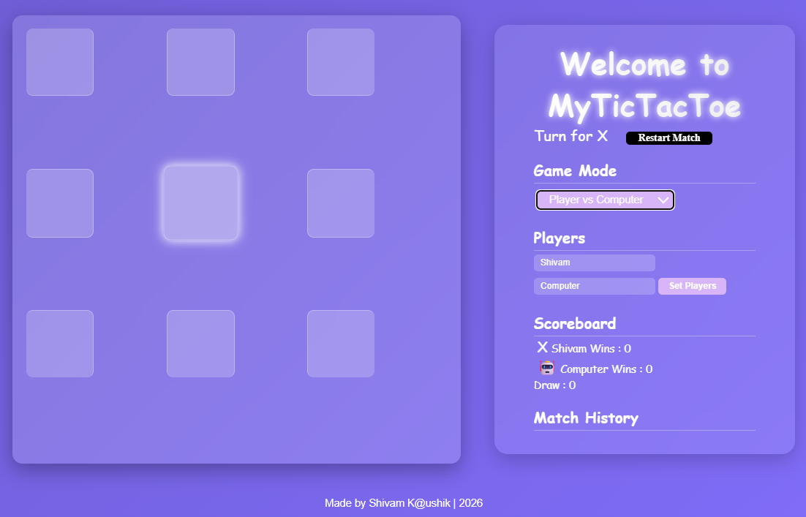

# 🎮 MyTicTacToe

A modern and interactive Tic Tac Toe game built using HTML, CSS, and JavaScript with AI support.

---

## 🚀 Live Demo
👉  https://kaushikshivam-stack.github.io/my-tictactoe/

---

## 📌 Features

- 🎮 Player vs Player Mode  
- 🤖 Player vs AI Mode (Minimax Algorithm)  
- 🌙 Dark Mode Toggle  
- 🔊 Sound Effects (Click, Win, Draw)  
- 📊 Scoreboard System  
- 🕘 Match History Tracking  
- 🎉 Win Animations & Confetti Effects  
- 📱 Responsive Design  

---

## 🧠 Tech Stack

- HTML5  
- CSS3 (Flexbox, Grid, Animations)  
- JavaScript (DOM, Events, Game Logic, AI)  

---

## 📸 Screenshots

  
  

---

## 🎯 Future Improvements

- Difficulty Levels (Easy / Medium / Hard)  
- Achievement System 🏅  
- Online Multiplayer 🌐  
- Better UI Animations  

---

## 👨‍💻 Author

**Shivam Kaushik**  

---

## ⭐ Show Your Support

If you like this project, give it a ⭐ on GitHub!
